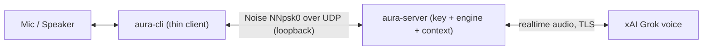
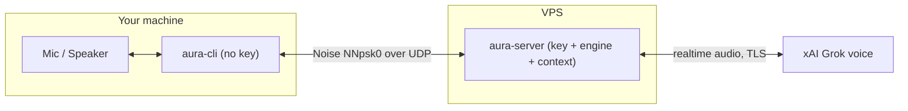
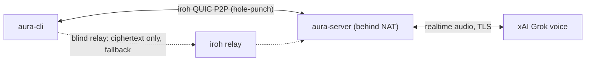
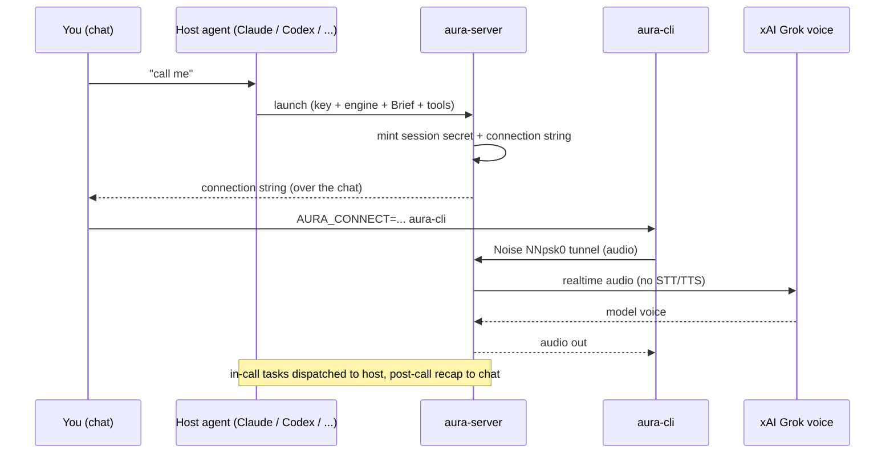

# aura

Voice calls for AI chats: type "call me" in a chat with an AI agent and get a realtime voice call with a model that already knows the conversation context.

The voice is a realtime audio-native model (xAI Grok voice): **direct audio, no STT/TTS** — your speech goes to the model and the model's voice comes back, with no speech-to-text in between. There is **no intermediary broker** — the AI's own server is the call endpoint. Audio rides a single **Noise (NNpsk0) tunnel over UDP**: the per-call session secret is the pre-shared key, so the link is mutually authenticated and forward-secret with no certificates, no domain, and no firewall punching beyond one UDP port. A call runs in one of two modes. **LOCAL** — the server runs on `127.0.0.1` on the same machine as the client, mic and model on one device. **REMOTE** — the AI server runs on a VPS and a thin client on your machine connects to it over the tunnel. Two binaries: `aura-cli` (the thin client: mic/speaker only, holds no key) and `aura-server` (the server the AI launches: holds the key, the engine, the chat context, and the tools). All-Rust, cross-platform (Linux / macOS / Windows).

## Connection Schemes

How audio flows in each mode. In every case the only content egress is the xAI
Grok voice model, and the media path has no intermediary broker; the tunnel is
**Noise (NNpsk0) over UDP** with the per-call session secret as the pre-shared
key.

### 1. Local call

Client and server on the same machine. The server binds `127.0.0.1`, so the
tunnel never leaves the box — your mic and the model are one loopback hop apart.



### 2. Remote call to a VPS server

The server runs on a VPS; a thin client on your machine dials it over one open
UDP port. The client holds no key — only your mic and speaker.



### 3. Remote call when the server is behind NAT/CGNAT (iroh)

When the server has no openable port, `AURA_TRANSPORT=iroh` switches the
transport to an iroh QUIC P2P link (hole-punching, with a blind encrypted relay
as fallback). **Noise NNpsk0 still runs _inside_ the iroh stream**, so the relay
only ever sees ciphertext and is used for fallback only.



### 4. Overall architecture

The launching chat is the server's identity: the host agent starts `aura-server`
(holding your xAI key, the engine, the chat Brief, and the tools), which mints a
single-use session secret and prints a connection string. The secret travels
over the same chat/gateway you already use; the client connects with it and the
server bridges audio to the model. When the call ends, a post-call summary is
delivered back into the chat.



## Install the client

You only ever install **`aura-cli`** on your own machine — it is the thin client with your mic and speaker. It holds no API key, no engine, and no chat context. Install it the fast way from a prebuilt binary (Linux / macOS), or build it from source (any platform) — both one-liners are below.

You need Rust. If you don't have it, the installer below sets it up via `rustup`; the repo pins Rust 1.92.0 (`rust-toolchain.toml`), which `rustup` selects automatically. To install Rust by hand:

```bash
curl --proto '=https' --tlsv1.2 -sSf https://sh.rustup.rs | sh -s -- -y
source "$HOME/.cargo/env"
```

**Linux only:** building the client needs the ALSA development headers (the client uses cpal for audio; the server does not, so a server-only build needs nothing here):

| Distro | Package | Command |
|---|---|---|
| Debian / Ubuntu | `libasound2-dev` | `sudo apt install libasound2-dev` |
| Fedora / RHEL | `alsa-lib-devel` | `sudo dnf install alsa-lib-devel` |
| Arch | `alsa-lib` | `sudo pacman -S alsa-lib` |
| openSUSE | `alsa-lib-devel` | `sudo zypper install alsa-lib-devel` |

macOS (CoreAudio) and Windows (WASAPI) need no extra audio package.

### One-line install

**Fastest — prebuilt binary (Linux / macOS), no toolchain, no compile:**

```bash
curl -fsSL https://raw.githubusercontent.com/RealWagmi/aura/main/install_bin.sh | bash -s -- --client
```

**Or build from source** (any platform; the only option on Windows, via `install.ps1`):

```bash
curl -fsSL https://raw.githubusercontent.com/RealWagmi/aura/main/install.sh | bash -s -- --client
```

Piping a script straight into a shell is convenient but you are trusting the source. The safe two-step is to download it, read it, then run it:

```bash
curl -fsSL https://raw.githubusercontent.com/RealWagmi/aura/main/install.sh -o install.sh
less install.sh          # read it
bash install.sh --client
```

### From a clone

```bash
git clone https://github.com/RealWagmi/aura aura
cd aura
./install.sh --client
```

Run via the `curl | bash` one-liner, `install.sh` first clones the source into `~/aura` (set `AURA_SRC_DIR` to change that); from a clone it builds in place. Either way it builds with `cargo build --release` and installs to `~/.local/bin` (override with `--prefix DIR`). No `sudo` is used. If `~/.local/bin` is not already on your `PATH`, the installer appends it to your shell rc and tells you to restart your shell or `source` it. On Windows use `install.ps1` from PowerShell instead. **Updating = re-running the installer**: it pulls the latest source (`git pull --ff-only`, skipped if you have local edits), rebuilds, and overwrites — same for the prebuilt `install_bin.sh`, which always fetches the latest release. Flags: `--client`, `--server`, `--prefix DIR`, `--uninstall`, `-h/--help`.

## Make a call

You ask the AI for a call ("call me", a slash command, etc.). The AI launches `aura-server`, which mints a single-use per-call secret (valid for about 120 seconds) and produces a **connection string** of the form:

```
aura://HOST:PORT#k=<secret>&c=<call_id>
```

The secret lives in the URL fragment. You connect by handing that string to the client through the `AURA_CONNECT` environment variable — never on the command line, so the secret never appears in `ps`:

```bash
AURA_CONNECT='aura://HOST:PORT#k=...&c=...' aura-cli
```

Or run `aura-cli` with no arguments and paste the string on its first line of standard input.

- **LOCAL call** — the AI runs the server on `127.0.0.1` on your machine and runs the `aura-cli` command for you; your mic opens and you talk.
- **REMOTE call** — the AI runs the server on its VPS and sends you the connection string over the chat; you run `AURA_CONNECT='aura://...' aura-cli` on your own machine.

**Open speakers / echo.** The client runs echo cancellation (WebRTC AEC3) on the mic by default, so you can talk — and interrupt the model mid-sentence — on open speakers without the model hearing itself. Headphones remain the zero-processing option. Tunables via the `AURA_AEC` environment variable: `on` (default), `gate` (no AEC — the mic is muted while the model speaks, so no barge-in), `off` (raw mic, headset users only).

When the call ends, the server posts a short recap of the in-call transcript back into the chat, so the AI can pick the conversation back up where the voice call left off.

## Run your own server (give your AI agent voice calls)

You don't run `aura-server` by hand — you ask **your own AI agent** to set it up once, and from then on it launches the server for you on every call. To start, paste this to your agent:

> **Linux / macOS (fastest — prebuilt binary):** Let's set up the aura voice server. Run `curl -fsSL https://raw.githubusercontent.com/RealWagmi/aura/main/install_bin.sh | bash -s -- --server`, then read and follow `https://raw.githubusercontent.com/RealWagmi/aura/main/docs/ONBOARDING_BIN.md`.

> **From source (any platform):** Let's set up the aura voice server. Run `curl -fsSL https://raw.githubusercontent.com/RealWagmi/aura/main/install.sh | bash -s -- --server`, then read and follow `https://raw.githubusercontent.com/RealWagmi/aura/main/docs/ONBOARDING.md`.

On **Windows** (source only), ask it to use PowerShell:

> Let's set up the aura voice server. Run `& ([scriptblock]::Create((irm https://raw.githubusercontent.com/RealWagmi/aura/main/install.ps1))) -Server`, then read and follow the source onboarding guide above.

The **binary** installer downloads a verified prebuilt archive and puts `aura-server` + the `aura-call` helpers on your `PATH` in seconds (Linux/macOS). The **source** installer clones into `~/aura`, sets up Rust, and builds. Either way, your agent then follows the onboarding guide to finish.

### What you'll need
- **An xAI API key** — aura is BYOK (bring your own key): it uses *your* key to reach the voice model directly, with no third party in between.
- **Time:** seconds via the prebuilt binary; a few minutes if building from source (it compiles and may fetch the Rust toolchain).
- **For a remote server only** — a host reachable over the network (e.g. a VPS) and the ability to open one UDP port on it.

### What your agent will ask you
Your agent does everything else on its own; it stops for your input only here:
1. **Your xAI API key** — it stores the key locally (a `chmod 600` `.env` file, your OS keychain, or the environment) and **never prints or logs it**; the key is only ever sent to `api.x.ai`.
2. **Local or remote?** *(only if it can't tell)* — *local* = the server runs on this same machine and you talk over loopback (nothing leaves the box); *remote* = it runs on a VPS and you dial in from your own machine.
3. **To run one `sudo` command** *(remote only, and only if it lacks root)* — to open the single UDP port once. It prints the exact command for you to run; it never touches your firewall silently.

After that, just say "call me" in your chat and your agent places the call. The full step-by-step (written for the agent) is **[docs/ONBOARDING.md](docs/ONBOARDING.md)**.

## Documents
- Onboarding / self-hosting the server: [docs/ONBOARDING.md](docs/ONBOARDING.md)
- Working guide for contributors: [CLAUDE.md](CLAUDE.md)

## Third-party licenses
aura statically links open-source components; notably the client's echo-cancel stage uses [sonora](https://github.com/dignifiedquire/sonora) — a pure-Rust port of the WebRTC audio-processing module (BSD-3-Clause, © The WebRTC Project Authors, Arun Raghavan and contributors, dignifiedquire). The full license texts ship with every release archive and live in [THIRD_PARTY_LICENSES.md](THIRD_PARTY_LICENSES.md).

## Repository layout
| Directory | Purpose |
|---|---|
| `crates/` | Library crates: `aura-core`, `aura-voice`, `aura-audio`, `aura-tunnel`, `aura-engine`, `aura-hosts`, `aura-feeder` |
| `bins/` | `aura-cli` (the thin client) and `aura-server` (the server the AI launches) |
| `scripts/` | helper scripts: `aura-open-port.sh` (one-time UDP-port open) plus the call helpers `launch-call.sh` / `call-status.sh` (installed on PATH by `install.sh` as `aura-call` / `aura-call-status`) |
| `skills/` | `SKILL.md` — the one universal host skill the AI copies into its own skills directory |
| `docs/` | `ONBOARDING.md` — server setup / self-hosting |

## Status
The Noise/UDP tunnel is built and reviewed; all four hosts (Claude / Codex / Hermes / OpenClaw) and the call engine are code-complete. Gates are green (`cargo build` / `test` / `clippy -D warnings` / `fmt`). What remains is live verification on real endpoints (a two-machine REMOTE call over real UDP) and the per-host trigger wiring. See [CLAUDE.md](CLAUDE.md) for the detailed state.

## Build (contributors)
```bash
cargo build --release                 # both binaries
cargo build --release -p aura-cli     # client only
cargo build --release -p aura-server  # server only (no audio package needed)
cargo test --workspace
```
The toolchain is pinned via `rust-toolchain.toml` (Rust 1.92.0).
